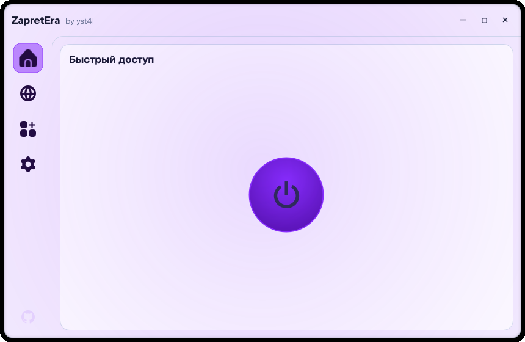
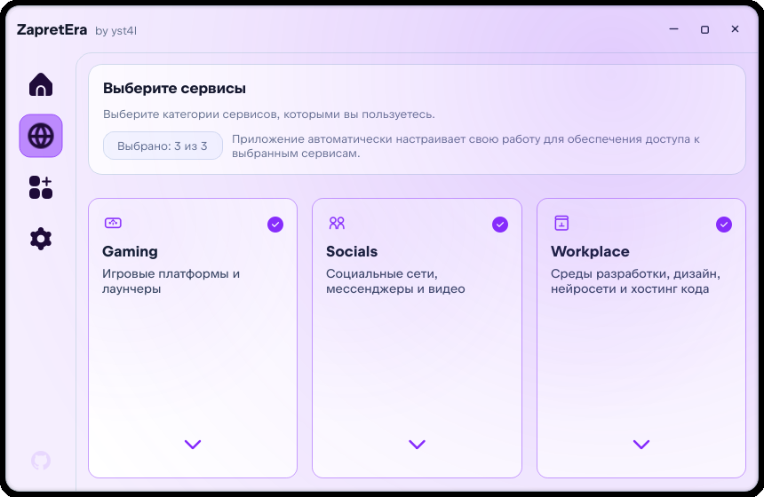
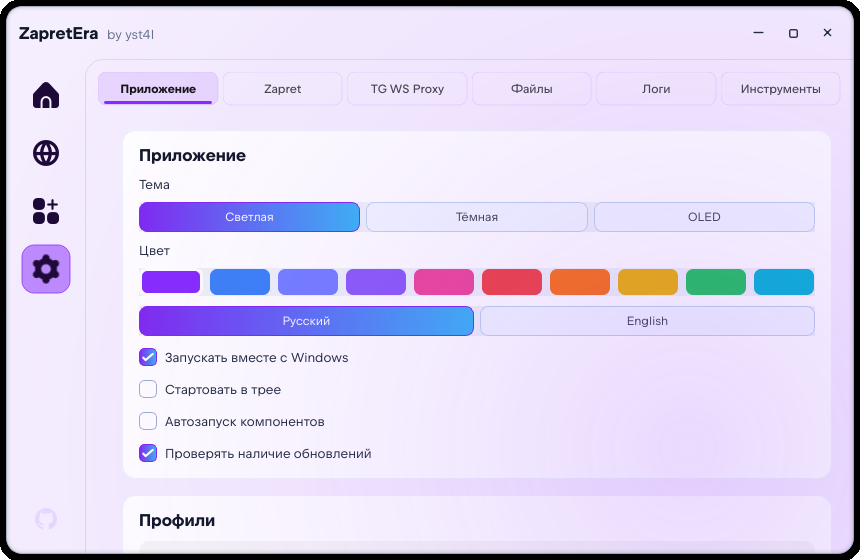

<picture>
  
</picture>

# ZapretEra

**Утилита для удобного и быстрого обхода блокировок на Windows**

Форк [Zapret-Zen](https://github.com/peshk0v/Zapret-Zen) от [peshk0v](https://github.com/peshk0v),
который, в свою очередь, основан на работе [goshkow](https://github.com/goshkow).
Распространяется под лицензией MIT с сохранением исходного копирайта.

## 🖼️ Скриншоты

| Главная | Сервисы | Настройки |
| :---: | :---: | :---: |
| <picture><source media="(prefers-color-scheme: dark)" srcset="assets/screenshot_dashboard_dark.png"><source media="(prefers-color-scheme: light)" srcset="assets/screenshot_dashboard_light.png"></picture> | <picture><source media="(prefers-color-scheme: dark)" srcset="assets/screenshot_services_dark.png"><source media="(prefers-color-scheme: light)" srcset="assets/screenshot_services_light.png"></picture> | <picture><source media="(prefers-color-scheme: dark)" srcset="assets/screenshot_settings_dark.png"><source media="(prefers-color-scheme: light)" srcset="assets/screenshot_settings_light.png"></picture> |

---

## ⚙️ Возможности

| Функция | Описание |
| :--- | :--- |
| 🛡️ **Обход блокировок** | Управление компонентами `zapret` и `tg-ws-proxy`: запуск, остановка, просмотр статуса, фоновый автозапуск |
| 👤 **Профили настроек** | Быстрое переключение между готовыми конфигурациями и пресетами под разные задачи и сети |
| 🎛️ **Пресеты сервисов** | Быстрый и удобный выбор сервисов, разбитых по категориям |
| 🎨 **Динамические темы** | Кастомизация интерфейса: Light, Dark, OLED темы и настраиваемые акцентные цвета |
| 🩺 **Диагностика** | Встроенный модуль проверки системы: тест связности, проверка DNS и целостности компонентов |
| ⚙️ **Автоконфигурация** | Автоматический подбор оптимальной стратегии на основе выбранных сервисов |
| 🔔 **Уведомления** | Нативная система информирования о событиях, ошибках и выходе обновлений |
| 📥 **Системный трей** | Работа в фоновом режиме, сворачивание и тихий запуск при старте ОС |
| 🪟 **Гибкое окно** | Изменение размера, разворот на весь экран, работа на мониторах любого разрешения |
| 🔄 **Автообновления** | Автоматическая проверка свежих релизов приложения прямо с GitHub |
| 🌐 **Локализация** | Полная поддержка русского и английского языков |

---

## 💻 Установка

### 📦 Портативная версия (Рекомендуется)

1. Скачайте архив `zapret_era_<version>.zip` со страницы [Releases](https://github.com/yst4lpizdec/ZapretEra/releases).
2. Распакуйте содержимое в удобную папку.
3. Запустите `zapret_era.exe`.

### 💿 Инсталлятор

1. Скачайте файл `install_zapretera_<version>_universal.exe` со страницы [Releases](https://github.com/yst4lpizdec/ZapretEra/releases).
2. Запустите мастер установки — он развернёт программу и добавит запись в стандартный список приложений Windows.

---

## 🧲 Используемые компоненты

| Инструмент | Автор / Проект |
| --- | --- |
| **zapret-discord-youtube** | [Flowseal](https://github.com/Flowseal/zapret-discord-youtube) |
| **tg-ws-proxy** | [Flowseal](https://github.com/Flowseal/tg-ws-proxy) |
| **zapret ecosystem** | [bol-van](https://github.com/bol-van/zapret-win-bundle) |

> [!CAUTION]
> ### Авторство и правовая информация
> 
> 
> **ZapretEra** является модификацией проекта **[Zapret Hub](https://github.com/goshkow/Zapret-Hub)** от [goshkow](https://github.com/goshkow), ныне поддерживающийся [klondike0x](https://github.com/klondike0x).
> Приложение не присваивает себе авторство встроенных утилит, оригинального интерфейса и менеджера. Пользователь вправе модифицировать файлы самостоятельно, однако авторские права оригинальных разработчиков сохраняются.
> В графическом интерфейсе используются иконки Uicons, права на которые принадлежат [Flaticon](https://www.flaticon.com/uicons).

---

> [!WARNING]
> ### Антивирус сообщает об угрозе
>
> Приложение использует WinDivert — драйвер для перехвата и фильтрации трафика. Без него локальная обработка трафика невозможна. Это вызывает срабатывание эвристик антивирусов.
>
> Загружайте приложение **только** из раздела [Releases](https://github.com/yst4lpizdec/ZapretEra/releases). Если антивирус удалил файл — восстановите его из карантина или переустановите приложение. Проверьте файл на [VirusTotal](https://www.virustotal.com/) для дополнительного спокойствия.

---

## 📞 Обратная связь

| Назначение | Ссылка |
| --- | --- |
| 🐛 **Проблема** | [Сообщить об ошибке](https://github.com/yst4lpizdec/ZapretEra/issues/new) |
| 💬 **Обсуждения** | [Задать вопрос или предложить идею](https://github.com/yst4lpizdec/ZapretEra/discussions) |

---

## ©️ Лицензия

Распространяется под лицензией [MIT](LICENSE).
